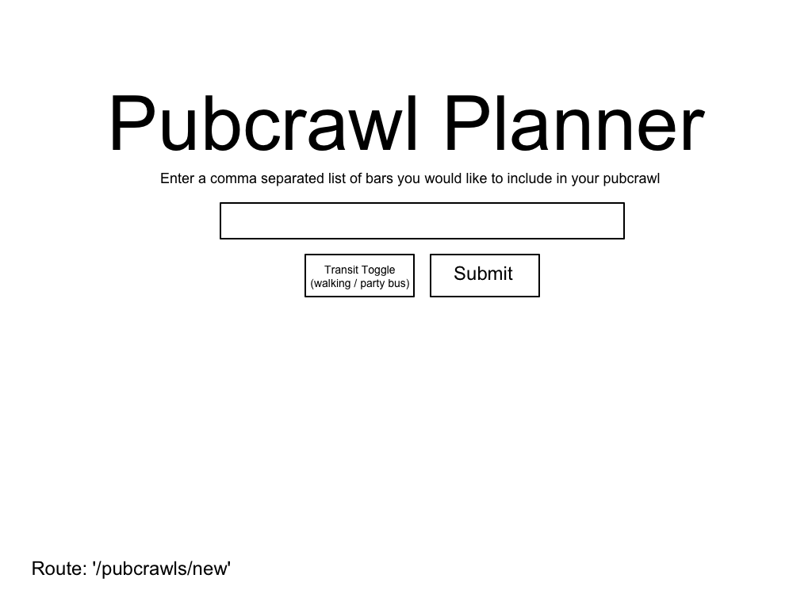
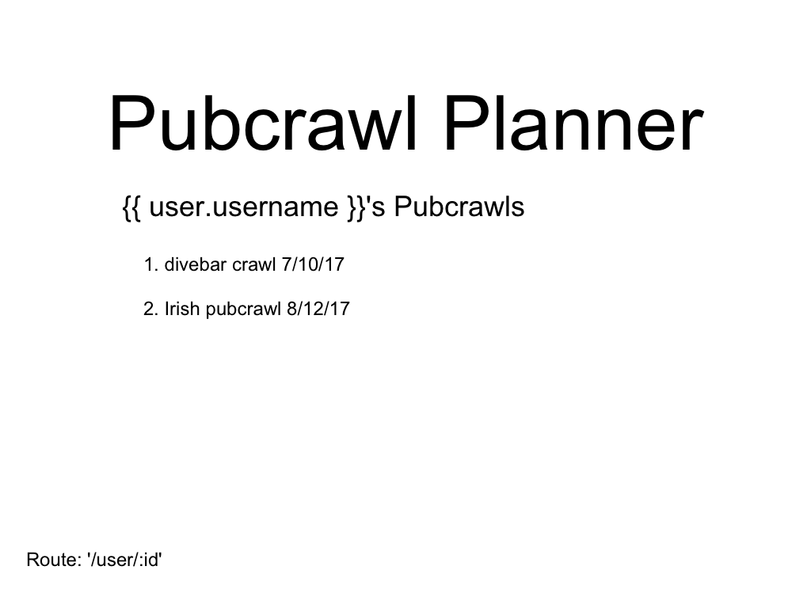
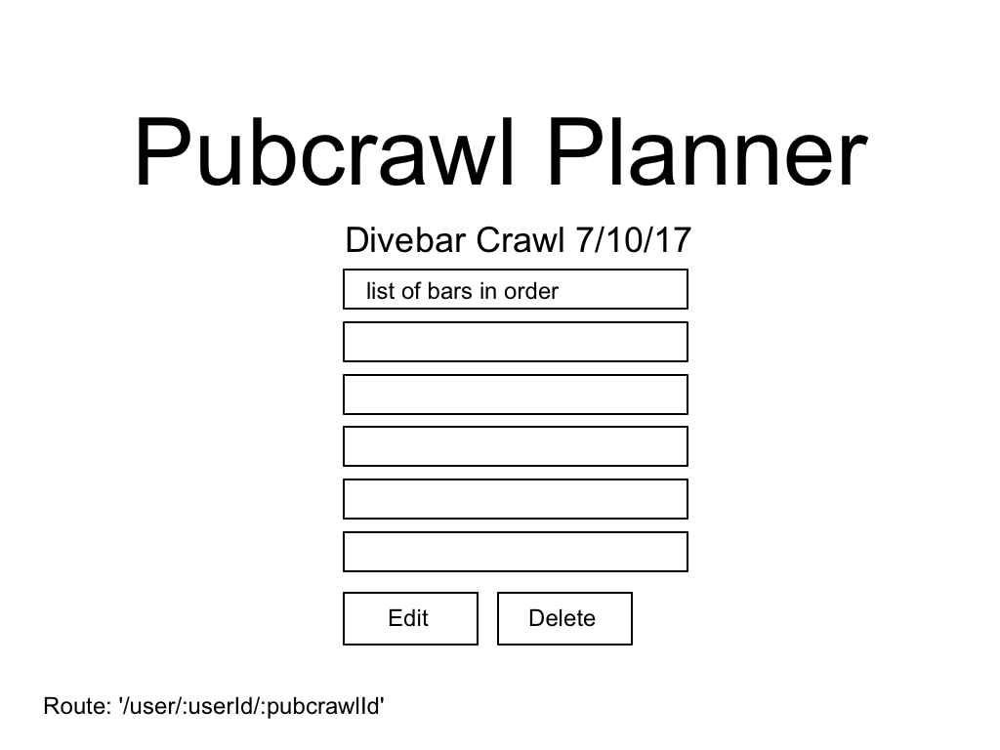
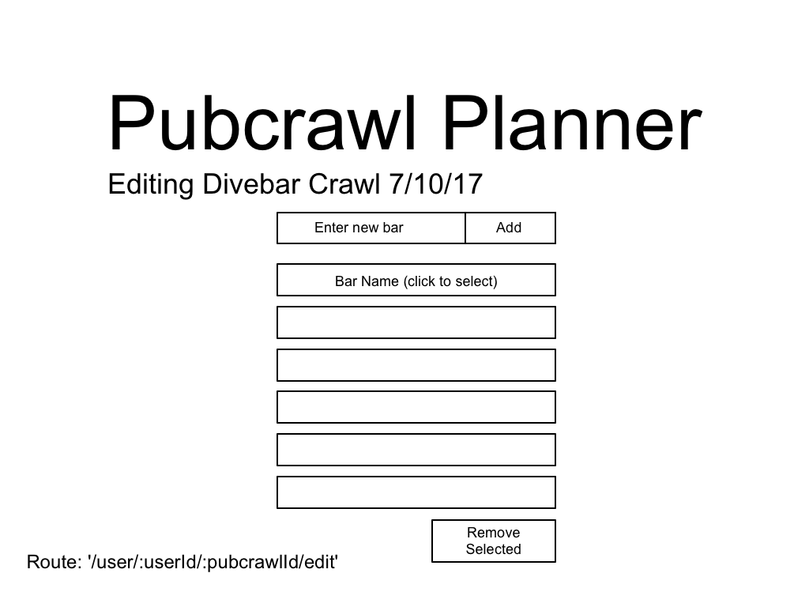
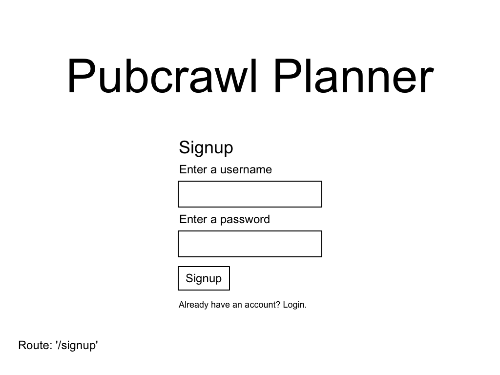
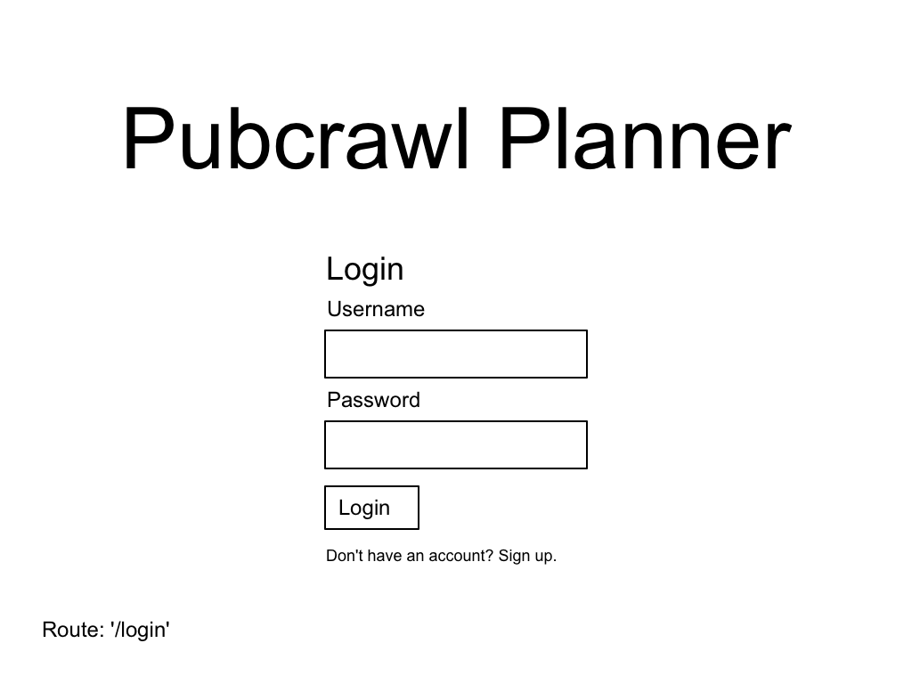
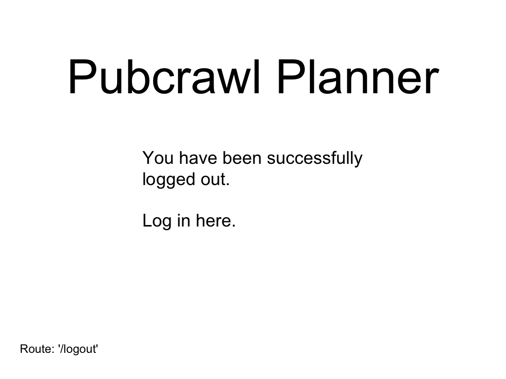

# 🍻 pubcrawl-planner 🍻

Pubcrawl planner is a MEN stack application that allows users to plan pubcrawls based on their favorite bars.

## 🍺 Deployment
Deployed to Heroku [here](https://pubcrawl-planner.herokuapp.com/).

## 🍺 User Stories

Link to trello board can be found [here](https://trello.com/b/gTpgYyxn/pubcrawl-planner).

## 🍺 ERDs

| User |
| --- |
| username: String |
| password: String |
| pubcrawls: [pubcrawl] |
| timestamp: createdAt: Date |
| timestamp: updatedAt: Date |
# ⬇
| Pubcrawl |
| --- |
| name: String |
| date: Date |
| locations: [bar] | 
# ⬇
| Bar |
| --- |
| name: String |
| number: Number |
| location: street: String |
| location: city: String |
| location: state: String |
| location: zip: Number
| location: lat: Number |
| location: lng: Number |

## 🍺 Wireframes

